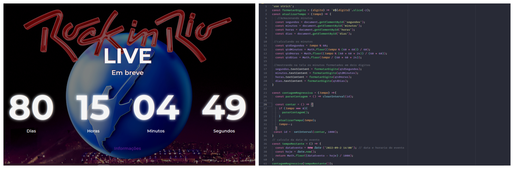

# Contagem regressiva com um evento
### Descrição do projeto 
Projeto para estudar JavaScript. Com o tema Rock in Rio, nele está acontecendo uma contangem regressiva até a data e horário do evento.

[Confira Agora](https://contagemregressivaevento.netlify.app/)

## ✔️ Tecnologias utilizadas

- ``HTML``
- ``CSS``
- ``JavaScript``
